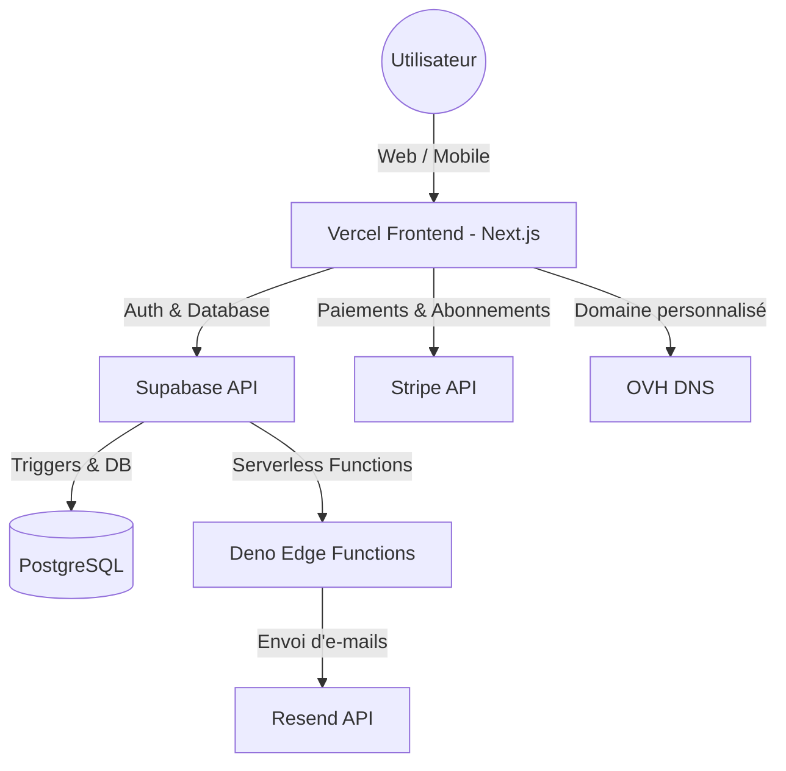

# EDEN · Facturation & compta

<!-- adam-badges:start -->
[](https://github.com/Adam-Blf/eden-facturation/commits)
[](https://hits.sh/github.com/Adam-Blf/eden-facturation/)
[](https://github.com/Adam-Blf/eden-facturation/commits)
[](https://github.com/Adam-Blf/eden-facturation)
[](LICENSE)
<!-- adam-badges:end -->

SaaS de **facturation et de comptabilité** pour micro-entreprise (EI). Génère
des factures au design **EDEN**, gère tes clients, suis ton chiffre d'affaires,
tes cotisations URSSAF et tes seuils micro. Conforme aux mentions légales FR
(art. L441-9 C.com, 293 B CGI, médiateur conso).

## ✨ Fonctionnalités

### Livré (v0.1)
- ✅ Éditeur de facture avec **aperçu PDF live** (même code React rend l'écran et le PDF)
- ✅ Design **EDEN** soigné · polices OFL (Spectral / PT Sans / IBM Plex Mono)
- ✅ Numéro de facture, infos émetteur/client, lignes multiples éditables
- ✅ Export PDF en un clic
- ✅ Bandeau compta live : Total HT · cotisations URSSAF estimées · net estimé
- ✅ Mentions légales auto (EI, 293 B, pénalités L441-10, médiateur conso si particulier)
- ✅ Schéma Supabase multi-tenant (RLS) prêt

### En cours / à venir
- 🛠️ **Auth Supabase** (comptes, multi-appareil)
- 🛠️ **Validation → envoi → acceptation client** : verrouillage de la facture, envoi par email, lien public tokenisé où le client clique « J'accepte » (horodatage + IP)
- 🛠️ CRUD clients + historique factures
- 🛠️ Dashboard compta (CA encaissé/dû, échéancier URSSAF, suivi seuils TVA/micro, export)
- 🛠️ Paiements (marquer payé, relances)
- 🛠️ **Billing SaaS Stripe** (abonnement Pro)
- 🛠️ Déploiement Vercel

## 🧱 Stack

Next.js 16 (App Router, Turbopack) · TypeScript · Tailwind CSS v4 ·
framer-motion · `@react-pdf/renderer` · Supabase (Postgres + Auth + RLS) ·
Stripe · lucide-react.

## 🏗️ Architecture



## 🚀 Démarrage

```bash
npm install
cp .env.example .env.local   # remplir Supabase + Stripe
npm run dev                  # http://localhost:3000
```

Base de données :

```bash
supabase db push             # applique supabase/migrations
```

## 📂 Structure

```
src/
  app/                 routes (landing, /facturation)
  components/          InvoiceEditor, PdfPreview
  lib/
    pdf/               InvoiceDocument (design EDEN) + fonts react-pdf
    supabase/          clients browser/server
    types.ts           modèle de données
    compta.ts          totaux, cotisations URSSAF, seuils
    format.ts          formatage € / dates fr-FR
supabase/migrations/   schéma SQL (RLS multi-tenant)
public/fonts/          polices OFL (Spectral, PT Sans, IBM Plex Mono)
```

## ⚖️ Conformité

Factures micro-entreprise conformes : mention « Facture », numéro unique,
dates, identité émetteur (EI + SIREN + RCS), client, désignation, total,
« TVA non applicable, art. 293 B du CGI », conditions de règlement, pénalités
de retard, et médiateur de la consommation pour les clients particuliers.

> ⚠️ Un numéro **SIREN** est obligatoire pour émettre une facture : s'immatriculer
> au guichet unique INPI avant toute émission.

## Licence

MIT — voir [LICENSE](LICENSE).
